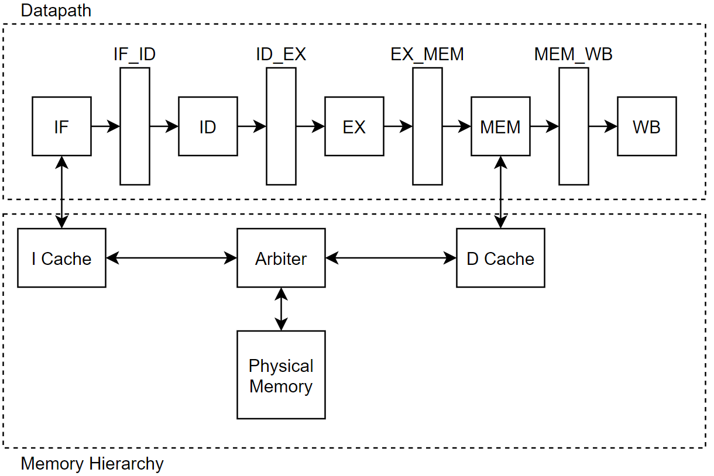

.. .. raw:: html
.. 
..     

.. role:: red
.. role:: redst

==========================
ECE 411: MP4 Documentation
==========================

-------------------------------------------------
A Pipelined Implementation of the RV32I Processor
-------------------------------------------------

    The software programs described in this document are confidential and proprietary products of
    Synopsys Corp. or its licensors. The terms and conditions
    governing the sale and licensing of Synopsys products are set forth in written
    agreements between Synopsys Corp. and its customers. No representation or other
    affirmation of fact contained in this publication shall be deemed to be a warranty or give rise
    to any liability of Synopsys Corp. whatsoever. Images of software programs in use
    are assumed to be copyright and may not be reproduced.

    This document is for informational and instructional purposes only. The ECE 411 teaching staff
    reserves the right to make changes in specifications and other information contained in this
    publication without prior notice, and the reader should, in all cases, consult the teaching
    staff to determine whether any changes have been made.

.. contents:: Table of Contents
.. section-numbering::

-----

Introduction
============

This machine problem involves the design of a pipelined microprocessor. You are required to
implement the RV32I instruction set (with the exception of ``FENCE*``, ``ECALL``, ``EBREAK``, and
``CSRR`` instructions) using the pipelining techniques described in lectures. This handout is an
incomplete specification to get you started with your design, a portion of this machine problem is
left open ended for you to explore design options that interest you.

You will begin your design by creating a basic pipeline that can execute the RV32I instruction
set. Then, you will add support for hazard detection and data forwarding, as well as integrating
a basic cache system to your pipeline. After implementing a functional pipeline
that can execute the RV32I ISA, you will have the opportunity to expand your design with
advanced design options of your choosing. For groups that correctly implement a functional pipeline,
a competition will be held to find which design can execute our benchmark program in the least
amount of simulation time and consuming the least amount of energy.

Getting Started
===============

Working as a Group
------------------

For this assignment, you must work in a group of three people (unless the class size is not a
multiple of three or you have been approved by the course staff). It will be your responsibility to
work on the assignment as a team. Every member should be knowledgeable about all aspects of your
design, so do not silo responsibilities and expect everything to work when you put the parts together.
Good teams will communicate often and discuss issues (either with the design/implementation or with teamwork)
that arise in a timely manner.

To aid collaboration, we provide a private Github repository [#]_ that you can use to share code
within your team and with your TA. 

Part of working well as a team is being courteous to the rest of the team, even when you plan to drop
the class. We ask that you let TAs and the rest of your team know as soon as possible if you plan to
drop ECE 411, so we can reassign other people and minimize the number of issues later in the semester.

.. [#] Your repository may not be immediately available as team assignments need to be finalized,
       and then the repositories are all created manually. You will be able to find the repository
       in the same location as your MP repository when it is ready. The repositories will be setup in time for the second checkpoint

Mentor TAs
----------

Given that every group's design will be different in MP4, it is often difficult for a TA unfamiliar
with your group to answer all of your questions. In order to make sure that each group has someone
who is knowledgeable about their design, each group will be assigned a mentor TA. You will have
regular meetings with your mentor TA, so that they know how your project is doing and any major
hurdles you have encountered along the way. You must meet with your mentor TA at least once every
week. Scheduling these meetings is *your* responsibility. Check with your mentor TA for their
preferred scheduling method/availability. In the past, some teams skipped the meetings without 
contacting mentor TAs in advance, and we have received course feedback asking that they be made mandatory.

Your first meeting with your mentor TA will be not only to review your paper design for your basic
pipeline, but also to discuss your goals for the project. Before meeting with your mentor TA, you
should have discussed in detail with your team about what design options you plan to explore. Your
mentor TA may advise against certain options, but you are free to work on whatever you like. As the
project progresses, you may find that your goals and your design change. This is normal and you are
free to take the project in a direction that interests you. However, you must keep your mentor TA up
to date about any changes you have made or plan to make.

In order to get the most out of your relationship with your mentor TA, you should approach the
relationship as if your group has been hired into a company and given the MP4 design as a job
assignment. A senior engineer has been assigned to help you stay on schedule and not get overwhelmed
by tool problems or design problems. *Do not* think of the TA as an obstacle or hostile party. *Do
not* try to "protect" your design from the TA by not allowing him or her to see defects or problem
areas. *Do not* miss appointments or engage in any other unprofessional conduct. If you plan to make
a late submission, your mentor TA should know as soon as possible, so they can make sure you are still
on track. Your mentor TA should be a consulting member of your team, not an external bureaucrat.

Testing
-------

Throughout the MP, you will need to generate your own test code. This is extremely important as
untested components may lead to failing the final test code and competition benchmark altogether.
Remember that in many of your components, such as the register bypassing unit, the order of the
instructions as well as what operands are used is crucial. You cannot just test that your processor
executes each of the instructions correctly in isolation. You should try to generate test code to
test as many corner cases as you can think of. In addition, we strongly encourage that you use the
verification techniques that you have learned so far in class to generate additional tests for each
new addition to your CPU.

Due to the flexibility of your design, we cannot provide a ready-to-go instantiation of the RVFI
monitor as we have in the past. You will need to figure out how to hook the monitor up on your own.
For help, you can visit the RVFI Monitor's `GitHub page <https://github.com/SymbioticEDA/riscv-formal>`_.

We do provide you with some skeleton code to help you start testing your design. Most of the
modifications will be made in ``hvl/top.sv`` and consist of connecting the correct design ports to
the correct interface ports. The only changes that should be made outside of ``hvl/top.sv`` are to
enable or disable various features in ``hvl/source_tb.sv`` for later checkpoints. This standard is
to allow for ease in autograding, should TAs decide to run the autograder. If the autograder will be
enabled, further details will be released when that determination is made.

As always, we expect you to fully read through all provided code and documentation before starting
your design. There may be requirements not explicitly mentioned in this documentation but are made
clear through a basic reading of the provided code. The TAs will make every effort to ensure
completeness of the documentation, but please read the provided code as well.

The Pipeline
============

Pipeline Control
----------------

In this pipelined design, you will be using a simple control memory to generate control signals. No
state diagrams will be allowed for basic pipeline control (state diagrams *are* still allowed for cache
controllers and other parts of your design). The control memory behaves similar to a ROM (read only
memory). When an instruction is ready to be decoded, the opcode (and possibly some other fields of
the instruction word) are sent to a logic block, which then outputs a ``control word`` containing
the signals necessary to control all the pipeline stages of the particular instruction. This control
word is then passed down the pipeline along with other operands needed for the instruction. To
assist in debugging, please pass the *entire* control word as well as the instruction's opcode and
PC down the pipeline. This allows the logic in each stage to be set correctly for that specific
instruction.

One way to implement the control memory discussed above is using a SystemVerilog case statement. You
can implement the control word as a ``struct`` containing the signals that you need. The following
code blocks contain examples for the control word struct and control ROM.

.. _Listing 1:

Listing 1: Example control word definition (define in ``rv32i_types.sv``)

.. code:: verilog

  typedef struct packed {
      rv32i_opcode opcode;
      alu_ops aluop;
      logic regfilemux_sel;
      logic load_regfile;
      /* ... other signals ... */
  } rv32i_control_word;

.. _Listing 2:

Listing 2: Example control memory module

.. code:: verilog

  import rv32i_types::*;

  module control_rom
  (
      input rv32i_opcode opcode,
      /* ... other inputs ... */
      output rv32i_control_word ctrl
  );

  always_comb
  begin
      /* Default assignments */
      ctrl.opcode = opcode;
      ctrl.load_regfile = 1'b0;
      /* ... other defaults ... */

      /* Assign control signals based on opcode */
      case(opcode)
          op_auipc: begin
              ctrl.aluop = alu_add;
          end

          /* ... other opcodes ... */

          default: begin
              ctrl = 0;   /* Unknown opcode, set control word to zero */
          end
      endcase
  end
  endmodule : control_rom

You should only use the ``opcode``, ``funct3``, and ``funct7`` fields from the instruction as the
inputs to this ROM. Also, you must not do any sort of computation in this ROM. The ROM is meant
exclusively for generating simple control signals such as mux selects. Do not use the control
ROM to perform computations (such as addition and branch condition comparisons).

Pipeline Datapath
-----------------

Regardless of your design, you will have to do things in a considerably different manner compared to
your previous MP datapath designs. When you start entering your design into the software tools,
start from scratch. Do not try to copy over your old core datapath design and then edit it.

Between each pipeline stage, you will need a set of registers to hold the values from the previous
stage. Unlike the design shown in the textbook, you do not need to implement those registers as one
colossal box. You are permitted to break the pipeline registers into many smaller registers
each containing one value (e.g., the ALU output, or a control word). Some example implementations
include:

- Modular stages with registered outputs. Break the pipeline into individual modules, each with an
  ``always_ff`` block to create flip-flops on the output signals. This option is the most
  "plug-and-play", allowing a stage's definition to be entirely self-contained.
- Modular stages and modular register "blocks". Each pipeline register is a module consisting of
  individual flip-flops for the relevant signals.
- Monolithic registers with packed structs. Define a struct for each stage's output and instantiate
  registers for these structs between the stages. This has the advantages of automatically scoping
  variable names (``ex.opcode`` vs ``mem.opcode``), allowing easy modification of the interface,
  and is more succinct.

There are no requirements on how you choose to implement your stages. Pick a style that works best for your
group.

Project Milestones
==================

MP4 is divided into several submissions to help you manage your progress. The dates for submissions
are provided in the class schedule. Late work will be based on the deadlines for each
individual milestone, with each part of a checkpoint submission evaluated separately. (For example,
submitting a paper design late will result in penalties for that paper design only.) 

Basic Pipeline Design
---------------------

The first submission for this project will be a design of your pipelined datapath. The design
must be detailed enough for the TAs to trace the execution of all the RV32I instructions through
your datapath. The paper design must map out the entire pipeline, including components in all the
stages (e.g., registers, muxes, ALU, register file), stage registers, and control signals. In other
words, with the paper design in hand, you should be able to easily translate your design into code.
`Figure 1`_ shows an example of the overall structure of a design. You may use a similar
diagram, but you must provide details of the components in each stage.

We will not require your design to handle data forwarding at this point, but you may still want to
design for it to avoid having to change your design down the road. You also do not have to have
designs for your cache or arbiter ready yet, though thinking about these ahead of time
can save you considerable effort in Checkpoint 2. If completed, designs for advanced features such
as branch prediction can also be included.

A good way to start the pipeline design is to first determine the number of stages and the function
of each stage. Then you can go through the RV32I ISA (e.g. ADD, JAL, BEQ, SLT, etc.) to see what components
need to be added to each stage for a given instruction. You can use the textbook and lecture notes as
references.

.. _Figure 1:

   Figure 1: Overview of pipeline datapath and cache hierarchy. Note the location of the pipeline
   stages, stage registers, and arbiter. Your designs should be **much** more detailed than this.

Checkpoints
-----------

There will be four checkpoints to keep you on track for this MP. For each checkpoint, you will be
required to have implemented a certain amount of of the functionality for your pipelined RV32I
design. In addition, at each checkpoint, you must meet, as a team, with your mentor TA and provide
him or her with the following information in writing:

- A brief report detailing progress made since the previous checkpoint. This should include what
  functionality you implemented and tested as well as how each member of the group contributed.
- A roadmap for what you will be implementing for the following checkpoint. The roadmap should
  include a breakdown of who will be responsible for what and paper designs for all design options
  that you are planning to implement for the next checkpoint.
  
Refer to the `Progress Report and Roadmaps`_ section for more details on writing these reports.

Besides helping the TAs check your progress on the MP, the checkpoints are an opportunity for you to
get answers to any questions that may have come up during the design process. You should use this
time to get clarifications or advice from your mentor TA.

Note that the checkpoint requirements outline the minimum amount of work that should have been
completed since the start of the project. You should work ahead where possible to have more time to
complete advanced design options.

Checkpoint 1: RV32I ISA and basic pipelining
~~~~~~~~~~~~~~~~~~~~~~~~~~~~~~~~~~~~~~~~~~~~

By checkpoint 1, you should have a basic pipeline that can handle all of the RV32I instructions (with the
exception of ``FENCE*``, ``ECALL``, ``EBREAK``, and ``CSRR`` instructions). You *do not*
need to handle any control hazards or data hazards. The test code will contain NOPs to allow the
processor to work without hazard detection. For this checkpoint you can use a dual-port "magic"
memory that always sets ``mem_resp`` high immediately, so that you do not have to handle cache misses
or memory stalls.

By the end of this checkpoint, you must provide your mentor TA with paper designs for data forwarding and hazard detection,
as well as a design for your arbiter to interface your instruction and data cache with main memory.

Checkpoint 2: L1 caches + hazards and static branch prediction
~~~~~~~~~~~~~~~~~~~~~~~~~~~~~~~~~~~~~~~~~~~~~~~~~~~~~~~~~~~~~~

By checkpoint 2, your pipeline should be able to do hazard detection and forwarding, including
static-not-taken branch prediction for all control hazards. Note that you should not stall or forward for
dependencies on register ``x0`` or when an instruction does not use one of the source registers (such as
``rs2`` for immediate instructions).

You must also have an arbiter implemented and integrated, such that both split caches (I-Cache and D-Cache) 
connect to the arbiter, which interfaces with memory. Since main memory only has a single port, your arbiter 
determines the priority on which cache request will be served first in the case when both caches miss and 
need to access memory on the same cycle. From this CP, make sure your ``mp4/bin/rv_load_memory.sh`` has 
``ADDRESSABILITY=32``

For groups who do not have a fully functional cache available, we will be providing a small cache for the
purposes of this checkpoint. We encourage groups to use their own designs if available, on this checkpoint
or when moving forward to your advanced design features.

At this point, you must provide your mentor TA with proposals for advanced features. These may be as detailed 
as you deem necessary -- anything from a written description to a hardware paper design. Your TA may have 
feedback on implementation details or potential challenges, so the more detail you provide now, the more 
helpful your TA can be.

Checkpoint 3: advanced design options
~~~~~~~~~~~~~~~~~~~~~~~~~~~~~~~~~~~~~

Checkpoint 3 is where your team can really differentiate your design. A list of advanced features
which you can choose to implement is provided in the `Advanced Design Options`_ section below, along
with their point values. This is **NOT an exhaustive list**; feel free to propose to your TA any feature
which you think may improve performance, who will add it to the list and assign it a point value.
The features in the provided list are designed to improve performance on most test codes based on
real-world designs.

In order to design, implement, and test them, you need to do background research and consult
your mentor TA. In order to decide on exact feature specifications and tune design parameters (e.g., 
branch history table size, and the size of victim cache), you need information about the performance of
your processor on different codes. This information is provided through **performance counters**.
You should at least have counters for hits and misses in each of your caches, for
mispredictions and total branches in the branch predictor, and for stalls in the pipeline (one for
each class of pipeline stages that get stalled together). Once you have added a few counters, adding
more will be easy, so you should add counters for any part of your design that you want to measure
and use this information to make the design better. The counters may exist as physical registers in
your design or as signal monitors in your testbench. You will not recieve any advanced feature points
without corresponding performance counters.

Note: While the features in CP3 are important for your final design, correctness is infinitely more
important than performance. In general, you should not move on to CP3 until your code works
completely on all of the provided test codes. See the `Grading`_ section for further details on
grading and consult your mentor TA if you become concerned about your progress.

Checkpoint 4: design competition
~~~~~~~~~~~~~~~~~~~~~~~~~~~~~~~~

By checkpoint 4, you must have your final, optimized design ready for the competition (note that
you do not need to keep all the advanced features you implemented in CP3 for the competition).

While implementing advanced features is required to earn design points, you should be designing with
performance in mind. In order to motivate performance-centric thinking, part of your CP4 grade will
be determined by your design's best execution time on the competition test codes we provide.
Your score in the competition will be based on your relative performance to other teams in the
class. Details of the scoring method are provided in the `Grading`_ section.

- Ensure that your code works correctly. **Designs which cannot 100% correctly execute the
  competition code will receive 0 points for the performance part.**
- You *may* use a separate design for advanced feature grading and for the competition (i.e., you do
  not have to be timed with you advanced features if they cause a performance hit on the competition
  codes).

Final Submission
----------------

Checkpoint 4 marks the end of this MP. Your final submission should include all design,
verification, and testcode files used for your CP4 design (both advanced features and competition).
You will need to demo your final submission with your TA to receive a score for the advanced
features and competition. If your designs are different, this is where you may show the changes.

For the final demo, your design should have all proposed features working correctly. You should be
able to demonstrate any advanced features that you expect to get design
points for, with your own test codes. You should also know how each feature affects the performance 
of your pipeline.

Presentation and Report
-----------------------

At the conclusion of the project, you will give a short presentation to the course staff (and fellow
students) about your design. In addition, you need to collect your checkpoint progress reports
and paper designs together as a final report that documents your accomplishments. **More information
about both the presentation and report will be released closer to the deadline.**

Grading
=======

MP4 will be graded out of 120 points, plus +18 points for extra credit. Out of the 120+18 points, 60 points are allocated for regularly
meeting with your TA, for submitting paper designs of various parts of your design, for a final
presentation given to the course staff, and for documenting your design with a final report. For
each checkpoint, you must meet with your mentor TA in order to showcase the functionality of
your design and your verification methods. Implementation points will NOT be given otherwise.

A breakdown of points for MP4 is given in `Table 1`_. Points are organized into two categories
across six submissions. Note that the number of points you can attain depends on what advanced
design options you wish to pursue.

.. _Table 1:

+-------------+-----------------------------------------+-----------------------------------------------------+
|             | Implementation [60+18]                  | Documentation [60]                                  |
+=============+=========================================+=====================================================+
| Design [5]  |                                         | - TA Meeting [1]                                    |
|             |                                         | - Basic RV32I pipelined datapath design [4]         |
+-------------+-----------------------------------------+-----------------------------------------------------+
| CP 1 [18]   | - Basic RV32I pipelined datapath [8]    | - TA Meeting [1]                                    |
|             |                                         | - Progress report [2]                               |
|             |                                         | - Roadmap [2]                                       |
|             |                                         | - Arbiter, hazard detection & forwarding design [5] |
+-------------+-----------------------------------------+-----------------------------------------------------+
| CP 2 [30+3] | - Integration of L1 caches [2]          | - TA Meeting [1]                                    |
|             | - Arbiter [3]                           | - Progress report [2]                               |
|             | - Hazard detection & forwarding [8]     | - Roadmap [2]                                       |
|             | - Static branch predictor [7]           | - Advanced features proposal and designs [5]        |
|             | - Competition code comp1.s runs [+1]    |                                                     |
|             | - Competition code comp2_i.s runs [+1]  |                                                     |
|             | - Competition code comp3.s runs [+1]    |                                                     |
+-------------+-----------------------------------------+-----------------------------------------------------+
| CP 3 [25+15]| - Advanced design options [20]          | - TA Meeting [1]                                    |
|             | - Extra advanced design options [+15]   | - Progress report [2]                               |
|             |                                         | - Roadmap [2]                                       |
+-------------+-----------------------------------------+-----------------------------------------------------+
| CP 4 [42]   | - Design competition [12]               | - Presentation [10]                                 |
|             |                                         | - Report [20]                                       |
+-------------+-----------------------------------------+-----------------------------------------------------+

Table 1: MP4 point breakdown. Points for each item are enclosed in brackets. Point numbers after "+" signs are extra credits.

The late penalty of this course will apply to work you submit late, so if you have something ready by the deadline, 
be sure to show it to your TA.

Additionally, there will be a small penalty for having independently functional design units that
are not successfully integrated. If you can demonstrate to your TA that each item works on its own,
you will receive full credit for that unit. Rather than deducting all of the implementation points,
failure to integrate design units will result in a 30% penalty. You may recover half of the lost
points by demonstrating full integration at a later date.

Progress Report and Roadmaps
----------------------------

You are responsible for submitting a progress report and a roadmap for each checkpoint. While these may
not seem like many points, they are instrumental in helping you and your mentor TA track your progress,
and can help address any issues you may have before they blow up.

Your progress report should mention, at minimum, the following:

- who worked on each part of the design 

- the functionalities you implemented

- the testing strategy you used to verify these functionalities

- the timing and energy analysis of your design: fmax & energy report from Design Compiler

You should be both implementing and verifying the design as you progress through the assignment. It will also be useful
for you to include an updated datapath with each progress report, as your design will inevitably change as
you complete the assignment. Making sure your datapath is up-to-date will help both you and your mentor TA
track changes in your design and identify possible issues. Additionally, a complete datapath will be required in your final report. 

The roadmap should lay out the plan for the next checkpoint: 

- who is going to implement and verify each feature or functionality you must complete

- what are those features or functionalities

It is also useful to think through specific issues you may run into, and have a plan for resolving the issues.

These are not intended to be very long. A single page (single-spaced) will be more than sufficient for both the
progress report and the roadmap. Be sure to check with your mentor TA, as they may have other details
to include on your progress report and roadmap.

Advanced Features
-----------------

Of the 60 implementation points, 28 will come from the implementation of the basic pipeline and
memory hierarchy. Up to 20 points will be given for the implementation of advanced design options.
Up to 12 points will come from your group's performance in the design contest. To receive any points
for the advanced design features, you must have numerical data which shows a change to your design's
performance as compared to not having implemented the feature. The best way to provide this data is
using performance counters. For each advanced design option, points will be awarded
based on the three criteria below:

- Design and implementation: Your group has a clear understanding of what is to be built and how to
  go about building it, and is able to produce a working implementation.

- Testing strategy: The design is thoroughly tested with test code and/or test benchmarks that you have
  written. Corner cases are considered and accounted for and you can prove that your design works as
  expected.

- Performance analysis: A summary of how the advanced design impacts the performance of your
  pipelined processor. Does it improve or degrade performance? How is the performance impact vary
  across different workloads? Why does the design improve or degrade performance?

A list of advanced design options along with their point values are provided in the
`Advanced Design Options`_ section.

Design Competition
------------------

The design competition will be scored based on two metrics of your processor design for each of the
test codes we provide. These metrics are energy and delay. A design with lower energy consumption and 
better performance will get your team ranked higher.  

For each test code, your processor will be assigned a score calculated as ``PD² * (100/Fmax)²``, or
``energy * (delay * 100/Fmax)²`` [#]_. The power used by your design is acquired through Design Compiler using an
activity factor generated by VCS Simulation. The factor of 100/Fmax is used to adjust the simulation time
based on your processor's maximum speed. Your final benchmark score will be the geometric mean of
your score on each test code.

To get full credit, you must exceed the baseline set by the TAs (announced at a later date).
You may earn makeup points (up to 10) based on your better performance on these two scales:`

- The first scale is a straight linear scale ranking all of the teams in the design competition.
  First place will receive full points, and non-functional designs will receive no points.
- The second scale is a linear scale between the score of the best performing design and a
  baseline MP4 CP3 design. The best score will receive full points, and the baseline design will
  receive no points.
- Your grade will be determined by the higher of these two scales. This ensures that very high
  performing designs in a competitive class are not penalized unfairly.

.. [#] The exact formula may be changed as the semester advances.

Group Evaluations
-----------------

At the end of the project, each group member will submit feedback on how well the group worked
together and how each member contributed to the project. The evaluation, along with feedback
provided at TA meetings throughout the semester, will be used to judge individual contribution to
the project. Up to 30 points may be deducted from a group member's score if it is evident that he or
she did not contribute to the project.

Although the group evaluation occurs at the end of the project, this should *not* be the first time
your mentor TA hears about problems that might be occurring. If there are major problems with
collaboration, the problems should be reflected in your TA meetings and progress reports. The
responses on the group evaluation should not come as a surprise to anyone.

Design Guidelines
=================

Basic Design
------------

Every group must complete the basic pipelined RV32I design which consists of the following:

- **Datapath**

  - 5-stage pipeline which implements the full RV32I ISA (less excluded instructions) [8]
  - Hazard detection and data forwarding (MEM → EX, WB → EX, WB → MEM, transparent register file,
    memory stalling) [8]
  - Static branch prediction [7]

- **Cache**

  - Integration of instruction and data caches [2]
  - Arbiter [3]

Advanced Design Options
-----------------------

The following sections describe some common advanced design options. Each design option is assigned
a point value (listed in brackets). Also note that based on
design effort, your mentor TA can decide to take off or add points to a design option. To obtain
full points for a design option, you must satisfy all the requirements given in the
`Advanced Features`_ grading section. If you would like to add a feature to this list, you may work
with your mentor TA to assign it a point value.

- `Cache organization and design options`_

  - `L2+ cache system`_ [2] (Additional points up to TA discretion)
  - `4-way set associative cache`_ [2] (8+ way will be worth more points; up to TA discretion)
  - `Parameterized cache`_ [points up to TA discretion]
  - Alternative replacement policies [points up to TA discretion] [#]_

- `Advanced cache options`_ 

  - `Eviction write buffer`_ [4]
  - `Victim cache`_ [6]
  - `Pipelined L1 caches`_ [6]
  - `Non-blocking L1 cache`_ [8]
  - `Banked L1 or L2 cache`_ [5]

- `Branch prediction options`_ 

  - `Local branch history table`_ [2]
  - `Global 2-level branch history table`_ [3]
  - `Tournament branch predictor`_ [5]
  - LTAGE branch predictor [8]
  - Alternative branch predictor [points up to TA discretion] [#]_
  - `Software branch predictor model`_ [2]
  - Branch target buffer, support for jumps [1]
  - 4-way set associative or higher BTB [3]
  - `Return address stack`_ [2]

- `Prefetch design options`_

  - `Basic hardware prefetching`_ [4]
  - `Advanced hardware prefetching`_ [6]

- `Difficult design options`_ 

  - `Memory stage leapfrogging`_ [12]
  - `RISC-V M Extension`_: A basic multiplier design is worth [3] while an
    advanced muliplier is worth [5]
  - `RISC-V C Extension`_ [8]

- `Superscalar design options`_ 

  - `Multiple issue`_ [15]
  - `Register renaming`_ [5]
  - `Scoreboarding`_ [20]
  - `Tomasulo`_ [20]

.. [#] For example, `<http://old.gem5.org/Replacement_policy.html>`_
.. [#] For example, Bi-Mode, TAGE, and Neural Branch Predictor

----

.. _Cache organization and design options:

**Cache organization and design options**

.. _L2+ cache system:

- **L2+ cache system**

  Your L1 cache system is constrained to respond within 1 cycle on a hit in order to facilitate
  your pipeline (unless you implement `Pipelined L1 caches`_). Therefore, your L1 caches
  cannot be too large without forming a large critical path, affecting your Fmax.
  This can be alleviated by adding additional levels of caches, which may respond in more than
  one cycle. Having additional caches can greatly speed up your design by keeping your Fmax high
  while also mitigating the affects of memory stalling.

  More complicated cache systems will be eligible for more advanced design feature points, feel free 
  to discuss your ideas/solutions with your mentor TA. 

.. _4-way set associative cache:

- **4-way set associative cache**

  If 2-way in your caches is not enough, you can choose to implement a 4-way set associative cache
  for any of your caches. The baseline is the pseudo-LRU replacement policy discussed in lectures.
  You may choose to implement additional ways (8+) as well as any other replacement policy, both of which
  will be eligible for additional points based on TA discretion.
  
.. _Parameterized cache:

- **Parameterized cache**:

  Instead of having statically sized caches, you can parameterize your cache to be able to use
  the same cache module in different parts of your design. You can parameterize the size and the number
  of sets, or also the number of ways or how many cycles it responds in. This feature will be largely
  dependent on how much effort you take and how many factors are parameterized and will be up to
  TA discretion.

.. _Advanced cache options:

**Advanced Cache Options**

.. _Eviction write buffer:

- **Eviction Write Buffer**

  On a dirty block eviction, a cache will normally need to first write the block to the next cache
  level, then fetch the missed address. An eviction write buffer is meant to hold dirty evicted
  blocks between cache levels and allow the subsequent missed address be processed first, and when
  the next level is free, proceed to write back the evicted block. This allows the CPU to receive
  the missed data faster, instead of waiting for the dirty block to be written first.

  The slightly more difficult version is a victim cache, which holds both dirty and clean evictions
  (detailed below).

.. _Victim cache:

- **Victim Cache**

  This is a version of the eviction write buffer on steroids. The buffer is expanded to be fully
  associative with multiple entries (typically 8-16), it is filled with data even on clean evictions,
  and is not necessarily written back to DRAM immediately. This enables a direct-mapped cache to
  appear to have higher associativity by using the victim buffer only when conflict misses occur.
  This is only recommended for groups who love cache.

.. _Pipelined L1 caches:

- **Pipelined L1 Caches**

  Switching the two cycle hit caches from MP3 to a single cycle hit for MP4 can create a long
  critical path and may affect your ability to meet timing. As opposed to switching to a single cycle hit, 
  you may retain the two cycle hits and have your caches process two requests at once. Your caches will recieve
  a request in the first stage, and respond with the data in the second stage. While responding,
  your cache should be able to process a new request in the first stage. This option must not
  stall your pipeline on a hit, but may stall the pipeline on a miss.

.. _Non-blocking L1 cache:

- **Non-Blocking L1 Cache**

  While a blocking cache serve a miss, no other cache accesses can be served, even if there is
  a hit. A non-blocking cache instead has the ability to queue misses in MSHRs (miss status holding
  registers) while continuing to serve hits. To make this ability useful, the
  processor must be able to support either out-of-order execution or memory-stage leapfrogging.

.. _Banked L1 or L2 cache:

- **Banked L1 or L2 Cache**

  A banked cache further divides each cache way into banks, which hold separate chunks of addresses.
  Each bank can be accessed in parallel, so that multiple memory accesses can begin services at once
  if there is no "bank conflict"; that is, each request is directed to a different bank. This option
  is useful for L1 for groups with a multiple-issue processor, and for L2 in the case of having both
  an i-cache and d-cache miss.

.. _Branch prediction options:

**Branch Prediction Options**

All branch prediction options require an accuracy of 80% or higher on all test codes. If you fail
to achieve this accuracy, you will not get any points for the branch predictor. On the off chance
the TAs release a competition code which performs poorly using a branch predictor, this requirement
may be waived for that test code by the TAs.

.. _Local branch history table:

- **Local Branch History Table**

  This is conceptually the simplest dynamic branch prediction scheme. It contains
  a table of 2-bit predictors indexed by a combination of the PC values and the history of
  conditional branches at those PC values.

.. _Global 2-level branch history table:

- **Global 2-Level Branch History Table**

  A global branch history register records the outcomes of the last N branches, which it then
  combines with (some bits of) the PC to form a history table index. From there, it works the same as
  the local BHT. By recording the past few branches, this scheme is able to to take advantage of
  correlations between branches in order to boost the prediction accuracy.

.. _Tournament branch predictor:

- **Tournament Branch Predictor**

  A tournament branch predictor chooses between two different branch prediction schemes based on
  which is more likely to be correct. You must maintain two different branch predictors (e.g., both a
  local and a global predictor), and then add the tournament predictor to select between which of the
  two is the best predictor to use for a branch. This predictor should use the two bit counter
  method to make its selection, and should update on a per-branch basis.

.. _Software branch predictor model:

- **Software Branch Predictor Model**

  To evaluate whether your branch predictor is performing as expected, you need to know its expectation. 
  To accomplish that, you can create a systemverilog model of your core and branch predictor.
  This model comes with the added benefit of helping you verify the rest of your core as well. Your
  branch predictor's accuracy must match the model's accuracy for points. If you do not implement a
  dynamic branch prediction model, this option is only worth a single point.

.. _Return address stack:

- **Return Address Stack**

  A return address stack leverages the calling convention to better predict the target of a jump.
  Refer to the RISC-V specification document for a description of the return address stack hints.
  Intuitively, ``PC+4`` should be pushed onto the stack when it looks like there is a call
  instruction, and an instruction that looks like a function return should pop the (predicted)
  return address off of the stack. This improves the BTB, since a BTB would give false predictions
  for a return instruction whenever the function is called from a different call site.

.. _Prefetch design options:

**Prefetch Design Options**

Prefetching is a technique that helps us avoid cache misses. Rather than waiting for a
cache miss to perform a memory fetch, prefetching anticipates such misses and issues a fetch to the
memory system in advance of the actual memory reference. This prefetch proceeds in parallel with
normal instructions' execution, allowing the memory system to transfer the desired data to
cache. Here are several options of implementing prefetching.

.. _Basic hardware prefetching:

- **Basic Hardware Prefetching**

  One block lookahead (OBL) prefetch, one of the sequential prefetching scheme that takes advantage
  of spatial locality. It is easy to implement. This approach initiates a prefetch for line ``i+1``
  whenever line ``i`` is accessed and results in a cache miss. If ``i+1`` is already cached, no
  memory access is initiated.

.. _Advanced hardware prefetching:

- **Advanced Hardware Prefetching**

  PC based strided prefetching. This prefetching scheme is based on following idea:

  - Record the distance between the memory addresses referenced by a load instruction (i.e., stride
    of the load) as well as the last address referenced by the load.
  - Next time the same load instruction is fetched, prefetch last address + stride.

  For more detail, refer to Baer and Chen, "An effective on-chip preloading scheme to reduce data
  access penalty," SC 1991.

.. _Difficult design options:

**Difficult Design Options**

.. _Memory stage leapfrogging:

- **Memory Stage Leapfrogging**

  This allows independent instructions to "jump past" the memory stage when there is a data cache
  miss. Note that this requires extra special care to make sure that the register file values are
  set correctly when the stalled instruction finally completes.

.. _RISC-V M Extension:

- **RISC-V M Extension**

  The RISC-V M extension specifies integer multiplication and division instructions.
  [#]_ The standard competition codes call library functions which emulate integer multiplication
  and division, since RV32I does not support these instructions. You will be provided with an
  alternate version of the competition code compiled for RV32IM which will leverage your hardware
  implementations of these operations. You are not allowed to simply use the SystemVerilog
  operators, you must implement these operations explicitly in logic, exploring the trade-off
  between frequency and cycles. You are not allowed to use IPs for this but you may use IPs for
  other aspects of your design with the permission of your mentor TA. You must come up with your own
  tests to convince your mentor TA that you have adequately tested each of the instructions in this
  extension, since the compiled competition codes would not exercise each instruction thoroughly.

  If you use the add-shift multiplier from MP1, or a similarly "simple" to implement multiplier, you
  will not recieve full credit for the M extension and will only get [3] points. Implementing a more
  advanced multiplier (like a Wallace Tree) will earn [5] points. The final determination of what
  is "simple" will be made by your mentor TA, so work with them in advance to fully understand how many
  advanced feature points your design is eligible for.

.. _RISC-V C Extension:

- **RISC-V C Extension**

  The RISC-V C extension specifies compressed 16-bit instruction formats for many common instruction
  occurrences. [#]_ Note that many of the instruction formats specified are for extensions that we are
  not using, so they can be ignored. As with the M extension, we will provide alternate versions of
  the competition codes compiled for RV32IC and RV32IMC, and you must provide your own test codes
  which adequately demonstrate the functionality of each instruction format specified in this
  extension.

.. _Superscalar design options:

**Superscalar Design Options**

.. _Multiple issue:

- **Multiple issue**

  A multiple issue processor is capable of dispatching and committing multiple instructions in a
  single cycle. This requires modifications to several major structures in your pipeline. First, you
  must be capable of fetching multiple instructions from your i-cache in a single cycle. You also
  must expand your register file ports to accommodate operand fetching and simultaneous writes. Your
  forwarding and hazard detection logic need to detect dependencies between in-flight
  instructions in the same as well as different pipeline stages. In order to obtain the most
  performance improvement for this option, you can implement it in conjunction with banked caches.

.. _Register renaming:

- **Register renaming**

  Similar to the forwarding used to fix read-after-write hazards in your pipeline, register renaming
  can fix write-after-write (WAW) dependencies. WAW dependencies are not an issue in standard MP4
  pipelines, but can arise if you implement memory stage leapfrogging, which means
  you may only get points for register renaming if you implement one of these two features. For
  scoreboarding and Tomasulo, register renaming is required and the points for register renaming are
  included in the points for those options.

.. _Scoreboarding:
.. _Tomasulo:

- **Scoreboarding, Tomasulo**

  These options are for designs that support parallel execution of multiple instructions, they cannot
  be combined with bonus points for memory stage leapfrogging. In general, we do not recommend these
  options for any groups, but some groups insist on implementing them, and some even succeed. For
  documentation, see the textbook.

  For full scoreboarding points, you may implement an out-of-order processor based on the
  scoreboarding structure. This option requires that you also implement register
  renaming. Discuss with your mentor TA for more details.

.. [#] M Extension Spec: `<https://content.riscv.org/wp-content/uploads/2017/05/riscv-spec-v2.2.pdf#page=47>`_
.. [#] C Extension Spec: `<https://content.riscv.org/wp-content/uploads/2017/05/riscv-spec-v2.2.pdf#page=79>`_

FAQs
====

- **Can we use state machines for our MP4 design?**

  Only in the cache hierarchy and advanced features, nowhere else. A non-pipelined cache or
  multicycle functional unit (i.e., multiplier) may use a state machine as its controller.

- **What does "no artificial stalls" mean?**

  *Note: This question is only relevant if you are pursuing the memory stage leapfrogging design
  option.*

  A better phrasing would probably be "no unnecessary stalls".  It means that non-dependent,
  non-memory instructions which follow a memory operation must not be stalled by the memory
  operation. This is true even if the memory instruction encounters a cache miss (Note: for the
  purposes of this requirement, write-after-write dependencies are considered valid
  dependencies.). We use some examples to further clarify this.

  Example 1::

      lw x1, label      # A, assume miss
      add x4, x4, x3    # B

  In this example, instruction B is not dependent on instruction A. It should not be stalled by the
  fact that instruction A will be in the MEM stage for multiple cycles. Instruction B should "go
  around" the MEM stage and proceed down the pipeline.

  Example 2::

      lw x1, label      # A, assume miss
      add x4, x1, x3    # B

  Here instruction B must stall because it is dependent on instruction A.

  Example 3::

      lw x1, label0     # A, assume miss
      lb x4, label1     # B

  Instruction B must stall, because it is a memory instruction.

  Example 4::

      lw x1, label      # A, assume miss
      add x4, x4, x3    # B
      sub x5, x1, x2    # C
      sra x6, x7, x8    # D

  Instruction B should not stall (independent). Instruction C must stall. Instruction D is
  independent, but may stall because the instruction before it is stalling. This illustrates that
  you can stop letting instructions "go around" the MEM stage once you encounter a dependent
  instruction.

  Example 5::

      lw x1, label      # A, assume miss
      beq x2, x3        # B

  Instruction B is independent of A, and should continue to writeback.

Advice from Past Students
=========================

- On starting early:

  - "Start early. Have everything that you have implemented also in a diagram, updating while you
    go."
  - "START EARLY. take the design submission for next checkpoint during TA meetings seriously. it
    will save you a lot of time. Front-load your advanced design work or sufferrrrr"
  - "start early and ask your TA for help.""
  - "Finish 3 days before it's due. You will need those 3 days (at least) to debug, which should
    involve the creation and execution of your own tests!"
  - "Make the work you do in the early checkpoints bulletproof and it will make your life WAY easier
    in the later stages of MP3."
  - Don't let a passed checkpoint stop you from working ahead. The checkpoints aren't exactly a
    perfect balance of work.
  - (In an end-of-semester survey, most students responded that they spent 10-20 hours per week
    working on ECE 411 assignments.)

- Implementation tips:

  - "Don't trust the TA provided hazard test code, just because it works doesn't mean your code can
    handle all data and control hazards."
  - "Also, it was very good to test the cache interface with the MP 2 cache, and test the bigger
    cache you do (L2 cache, more ways, 8-way pseudo LRU) on the MP 2 datapath. This just makes it
    easier to stay out of each other's hair."
  - "Run timing analyses along the way so you're not trying to meet the 100 MHz requirement on the
    last night."
  - "Write your own test code for every case. Check for regressions."
  - "Don't pass the control bits down the pipeline separately, pass the *entire* control word down
    the pipeline. Also, pass the opcode and PC down. These are essential when debugging."
  - "Check your sensitivity lists!!"
  - "Hook up the debug utilities, shadow memory and RVFI monitor, early. It helps so much later."
  - "RISC-V MONITOR please start using it at CHECKPOINT 1!"  (TA note: we suggest using RVFI
    Monitor beginning with CP3.)
  - "Performance counters might seem unnecessary at first, but they totally saved our competition
    score. Make a lot of them, and use them!!"

- Possible difficulties:

  - "Implement forwarding from the start, half of our bugs were in this. Take the paper design
    seriously, we eliminated a lot of bugs before we started."
  - "Integration is by far the most difficult part of this MP. Just because components work on their
    own does not mean they will work together.''
  - "The hard part about mp3 is 1) integrating components of your design together and 2) edge cases.
    Really try to think of all edge cases/bugs before you starting coding. Also, be patient when
    debugging."
  - "You might think it makes sense to gate the clock in certain circumstances. You are almost certainly
    wrong. Don't gate the clock."
  - "The TAs might seem nice, but they don't give you very good testcode. Make sure to write your own."

- On teamwork:

  - "Try to split up the work into areas you like -- cache vs datapath, etc. You will be in the lab
    a lot, so you might as well be doing a part of the project you enjoy more than other parts"
  - "Don't get overwhelmed, it is a lot of work but not as much as it seems actually. As long as you
    start at least a paper design ASAP, you should finish each checkpoint with no problems."
  - "Come up with a naming convention and *stick to it*. Don't just name signals ``opcode1``,
    ``opcode2``, etc. For example, prepend every signal for a specific stage with a tag to specify
    where that signal originates from (``EX_Opcode``, ``MEM\_Opcode``)."
  - "Label all your components and signals as specific as possible, your team will thank you and you
    will thank yourself when you move into the debugging stages!"
  - "Learn how to use Github well! It is very difficult to get through MP3 without this knowledge."
  - "If you put in the work, you'll get results. All the tools you need for debugging are at your
    disposal, nothing is impossible to figure out."
  - "Split up the work and plan out which parts everyone will work on each checkpoint. You can always
    help each other out, but make sure you know who is responsible for each part."
  - "You need to be able to read each other's code. Agree on a style head of time, and don't rely on
    others all the time. Not being able to read code makes debugging unnecessarily difficult."

Notes
=====

This document is written in reStructuredText (rst), a markup language similar to Markdown, developed
by the Python community. rst files are automatically rendered by Github, so you shouldn't need to
download or save anything to see the documentation.  However, if you would like an offline version
of the file, you may use the HTML version in the MP directory. Follow the steps below to generate
your own HTML or PDF version.

Install Python docutils if not already installed::

  $ pip3 install --user docutils

Use a docutils frontend to convert rst to another format::

  $ rst2html5 README.rst MP4_spec.html
  $ rst2latex README.rst MP4_spec.tex

If creating a PDF using LaTeX, you will need a TeX distribution installed. You can then use::

  $ pdflatex MP4_spec.tex

Note that this document was optimized for viewing online in the Github repository. Generated HTML
files should match pretty closely to what you will see on Github, perhaps with different styles.
PDF documents will likely look different though, so use at your own risk.

See the `Docutils Front-End Tools`__ for more details.

__ http://docutils.sourceforge.net/docs/user/tools.html
